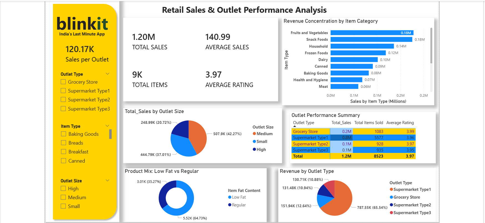

# 🛒 Blinkit Sales & Outlet Performance Dashboard (Power BI)

## 📌 Project Overview
This Power BI project analyzes Blinkit retail sales and outlet performance to understand revenue drivers, outlet efficiency, and customer behavior.

## 🛒 Revenue Drivers & Outlet Performance Intelligence
- Sales revenue is highly concentrated in a small number of item categories, with Fruits & Vegetables and Snack Foods contributing a significant share of total sales.
- Supermarket Type 1 outlets generate the majority of revenue, indicating higher operational efficiency and stronger customer demand.
- Medium-sized outlets outperform small and large outlets in total sales contribution, highlighting optimal store sizing.
- Product mix analysis shows a higher preference for regular-fat items compared to low-fat alternatives.
- Customer ratings remain consistent across outlet types and locations, suggesting sales differences are driven by scale and assortment rather than satisfaction.

## 🛠 Tools Used
- Power BI – Interactive dashboards & DAX measures
- Data Modeling & Relationships
- Data Cleaning & Transformation
- Business Intelligence Reporting

## 📷 Dashboard Preview

## 📈 Retail Optimization & Decision Support Value
- Enables management to identify high-performing outlet types and prioritize expansion strategies.
- Supports assortment and inventory optimization by highlighting top revenue-generating categories.
- Helps optimize outlet sizing decisions based on sales efficiency.
- Provides actionable insights for improving revenue planning and category-level promotions.
- Strengthens data-driven decision-making through interactive Power BI dashboards.

## 👤 Author
Yash Shirture  
Data Analyst | Excel • SQL • Power BI

